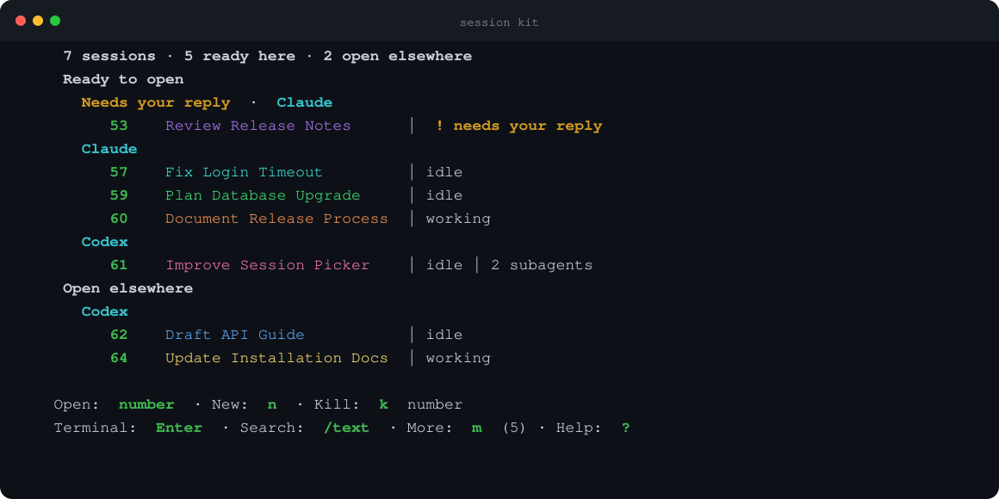

# Session Kit

[](https://github.com/dob323/session-kit/actions/workflows/ci.yml)
[](https://github.com/dob323/session-kit/releases/tag/v0.1.1)
[](LICENSE)

A local status and safety layer for shpool sessions running Claude Code, Codex,
or shells over SSH.



The image is rendered from the real picker with demo-only session data by
`tools/render-readme-dashboard`; it is not a mock of a different interface.

Session Kit gives each managed terminal a stable number, useful name, color,
reply state, and exact provider identity. It keeps the terminal alive when a
provider exits and refuses actions when live identity cannot be proved.

> [!WARNING]
> `v0.1.0` is a public beta for Linux with systemd and macOS 14 or newer.
> Start on a single-user account where Claude Code and Codex conversations can
> be recovered. Session Kit is not a boundary against another process running
> as the same Unix user.

## Highlights

- One on-demand picker for Claude Code, Codex, and shell sessions.
- `needs your reply`, working, idle, quiet, provider-exited, and subagent state.
- Exact open, move, close, reopen, fork, repair, and recovery checks.
- Manual names plus guarded 2–5 word agent self-names.
- A visible `title pending` state when a Codex bar still needs a safe refresh.
- Immutable local releases with atomic update and rollback.
- Optional terminal journals, off by default.
- No account, hosted service, analytics, update beacon, or telemetry.

Normal rows hide shpool IDs and provider UUIDs. Use `sp detail`, JSON output, or
an explicit search when diagnosis requires exact identity.

## Install the beta release

Download the archive, checksum, and provenance files attached to the
[`v0.1.1` release](https://github.com/dob323/session-kit/releases/tag/v0.1.1).
With the GitHub CLI:

```bash
mkdir session-kit-download
cd session-kit-download
gh release download v0.1.1 --repo dob323/session-kit
if command -v sha256sum >/dev/null; then
  sha256sum --check session-kit-*.sha256
else
  shasum -a 256 --check session-kit-*.sha256
fi
tar -xzf session-kit-*.tar.gz
cd session-kit-*/
./install.sh --check
./install.sh
session-kit doctor
session-kit services enable
```

The preflight is read-only. Installation copies an immutable release and
systemd or launchd definitions, but it does not start, stop, restart, or enable
a service. Review the definitions before `services enable`. The guided
installer can add the shell integration; journals remain off unless you
explicitly enable them.

For requirements, manual asset download, and activation checks, read
[Install Session Kit](docs/install.md). Use `main` only for development after
reviewing and testing its exact commit.

## Use it

SSH opens a normal shell. Type `kit` when you want the session picker.

```text
kit
sp list
sp new [claude|codex|shell] [project-alias]
sp go <terminal-number|shpool-id>
sp takeover <terminal-number|shpool-id>
sp name <terminal-number|shpool-id> <title>
sp name reset <terminal-number|shpool-id>
sp close <terminal-number|shpool-id>
sp repair <terminal-number|shpool-id>
sp detail <terminal-number|shpool-id>
sp find <text>
sp history <terminal-number|shpool-id>
sp health
sp recover
sp prune
```

The picker accepts one visible number to open a session. `k` accepts visible
numbers, comma-separated lists, and small ranges. Every action uses a frozen
private proof and rechecks live identity immediately before changing anything.
A cached or stale dashboard is read-only.

If a new Codex process started before its thread acquired a name, the row shows
`title pending`. A detached, proven-idle provider can refresh automatically on
open. An attached provider is never restarted automatically; its action menu
offers an explicit refresh only when the exact provider is idle and has no
subagents.

## Safety and privacy

Session Kit treats a provider UUID and exact process generation as identity.
Titles, numbers, directories, timestamps, and terminal output are display
context only. Missing, duplicated, changed, or partial evidence fails closed.

The default local footprint is privacy-minimal:

- journals and notifications are off;
- provider transcripts remain in provider-owned storage;
- the picker action log stores only fixed action and outcome labels;
- private state is owner-only and never uploaded by Session Kit.

Optional journals can contain prompts, credentials, source code, and command
output. Read [Security and local data](docs/security-and-data.md) before
enabling them.

## Documentation

- [Install](docs/install.md)
- [Configure](docs/configuration.md)
- [Use Session Kit](docs/usage.md)
- [Claude Code and Codex integration](docs/provider-integration.md)
- [Security and local data](docs/security-and-data.md)
- [Troubleshoot](docs/troubleshooting.md)
- [Update and roll back](docs/update-and-rollback.md)
- [Uninstall](docs/uninstall.md)
- [Architecture](docs/architecture.md)
- [Maintainer release process](docs/maintainers/release-process.md)

Issues and pull requests are welcome. Read [Contributing](CONTRIBUTING.md).
Report vulnerabilities through [Security policy](SECURITY.md), never through a
public issue.

## License

Session Kit is released under the [MIT License](LICENSE). The optional shpool
patch modifies Apache-2.0 software; see [Third-party notices](THIRD_PARTY_NOTICES)
and the included [Apache License 2.0](LICENSES/Apache-2.0.txt).
