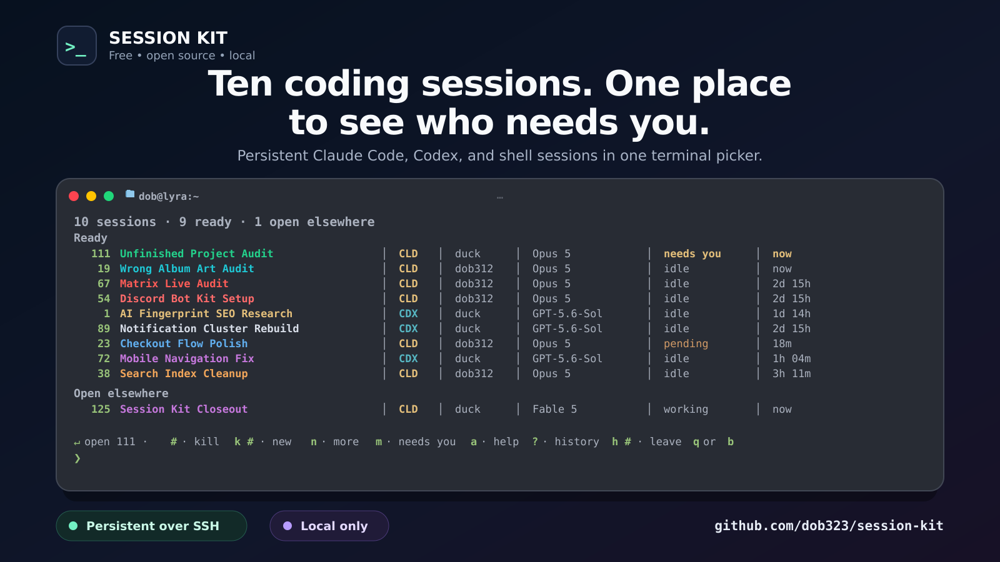
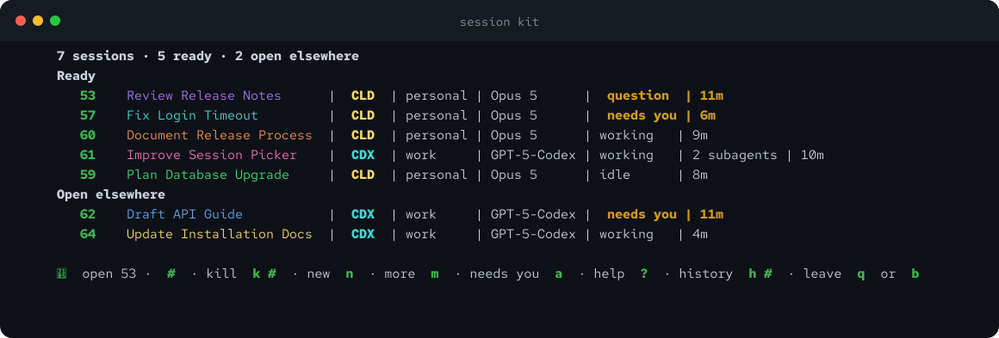

# Session Kit

[](https://github.com/dob323/session-kit/actions/workflows/ci.yml)
[](https://github.com/dob323/session-kit/releases)
[](LICENSE)

Session Kit keeps your terminal AI sessions safe, named, and one keypress
away. It is a local status and safety layer for shpool sessions running
Claude Code, Codex, or shells over SSH: every session gets a stable place in
one picker, and the kit proves live identity again before it opens, moves,
closes, or restores anything. Drop your connection mid-answer, SSH back in,
press Enter — the same session is still going. That is the whole pitch;
everything else is guardrails around it.



## Where it runs

Install Session Kit on the Linux or macOS machine where Claude Code or Codex
actually runs. There is no separate server to set up.

- On the machine in front of you, it organizes your sessions and keeps them
  alive when a terminal window closes.
- On a remote host, it also lets you disconnect from SSH — on purpose or not —
  and pick the same session up later, from any window.
- Sessions live as long as that host stays powered on and awake. The laptop or
  phone you connect from can sleep, disconnect, or shut down freely.
- Want sessions available around the clock? Run the kit on something that
  stays on — a server, a workstation, a Mac mini. Optional, but that is what
  makes overnight work possible.
- A host shutdown or reboot ends the running processes themselves; the
  conversations they carried are recoverable afterwards from Closed sessions.

## What it is

Every session gets a number, a useful name, a colour, a model, a state, and an
exact provider identity. One list holds all of them. Guards run before every
action: anything without good enough evidence is refused with the reason, and
a completed action says what happened. A close is recoverable from Closed
sessions.

Session Kit also supplies guarded account and model changes, optional local
history, per-session colours, project shortcuts, health checks, immutable local
releases, and atomic update and rollback. It has no hosted account, analytics,
update beacon, or telemetry.

> [!WARNING]
> Session Kit is a public beta for Linux with systemd and macOS 14 or newer.
> Start on a single-user account where Claude Code and Codex conversations can
> be recovered. Session Kit is not a boundary against another process running
> as the same Unix user.

## The picker

Type `kit` from an ordinary shell. Ready sessions appear before sessions that
are open elsewhere, and sessions waiting on you sort first inside each group.
Machine-started sessions (background workers and health checks) stay behind
one counted row.

Enter takes the most likely option on every screen:

- on the home screen, it opens the top row, or starts a new session when the
  list is empty;
- New session defaults to Claude Code;
- a session open elsewhere defaults to moving it into this window;
- `b` goes back, including from the home screen where back means leave.

The key-driven footer starts with `↵ open <number>` or `↵ new`. At narrow
widths it keeps the most useful segments first: Enter, number selection, kill,
new, more, needs you, help, history, then leave. A close keeps the session
number you typed, so the result and the refreshed list still refer to the same
selection. The cursor-driven screen adds arrows and mouse input; both screens
use the same state words and safety checks.

| State | Meaning |
| --- | --- |
| `question` | Claude has a blocking prompt open right now. Codex does not claim this state yet. |
| `needs you` | The provider has finished its turn and the session is waiting for you. |
| `working` | The provider is driving the current turn. |
| `idle` | A needs-you transcript has not moved for the configured window, 30 minutes by default. |
| `pending` | The kit cannot currently read the value; this is a placeholder, not a state. |

An unreadable idle-window setting disables the `idle` label instead of
guessing. `sp detail` also shows live child shells and workers that are at
least an hour old, with their age.

A picker already running during an upgrade reloads itself from the new release
at a safe refresh point and keeps its view. If the new launcher cannot start,
the old picker stays in place and reports the degraded target.



See [Picker navigation](docs/picker-navigation.md) for every key, action, and
fallback.

## Install

Download the archive, checksum, and provenance files attached to the
[`v0.4.1` release](https://github.com/dob323/session-kit/releases/tag/v0.4.1).
Beta releases are GitHub prereleases, so browse
[all releases](https://github.com/dob323/session-kit/releases) or name the tag
explicitly. Assets are named by commit rather than by version.

```bash
mkdir session-kit-download
cd session-kit-download
gh release download v0.4.1 --repo dob323/session-kit
if command -v sha256sum >/dev/null; then
  sha256sum --check session-kit-*.sha256
else
  shasum -a 256 --check session-kit-*.sha256
fi
tar -xzf session-kit-*.tar.gz
cd session-kit-*/
./install.sh --check
./install.sh
session-kit doctor
session-kit services enable
```

### Install with an AI assistant

If an AI agent (Claude Code, Codex, or similar) runs your terminal, you can
hand it the whole job. Paste it this brief:

> Install Session Kit from https://github.com/dob323/session-kit. Download the
> latest release archive with its `.sha256` and `.provenance.json` files,
> verify the checksum, extract, and run `./install.sh --check` first — fix
> anything it names before running `./install.sh`. Then run
> `session-kit doctor`, then `session-kit services enable`, then
> `session-kit doctor` again, and show me the final doctor output. Never work
> around a refused step: a refusal prints its exact remedy, and
> `docs/install.md` and `docs/troubleshooting.md` inside the archive answer
> the rest. Finish by telling me to type `kit`.

This is safe to delegate because every gate fails closed: the preflight is
read-only, a refused step names its remedy instead of guessing, and the
install either lands a complete immutable release or stops with the reason.
An agent cannot leave the machine half-installed.

### What lands on disk

The archive contains the complete public source, documentation, tools, and
tests. Installation copies the runtime subset — `bin`, `lib`, `bashrc`,
`config`, `deploy`, `systemd`, `macos`, `shpool-patch`, and `extras` — into an
immutable local release.

The preflight is read-only. Activation writes service definitions and refreshes
the kit watchdog already in use. On Linux it reloads the user manager, enables
new timers systemd has never seen, and try-restarts the running watchdog; it never
re-enables a timer you disabled and never restarts the session manager. On
macOS it refreshes an already loaded kit watchdog. `session-kit services
enable` starts the full reviewed set.

Upgrading an older installation repairs its internal ordering state
automatically. When that state cannot be proved, activation refuses and
prints the exact recovery command instead of inventing a value.

For requirements, manual downloads, shell integration, and activation checks,
read [Install Session Kit](docs/install.md).

## Recommended terminal: Ghostty

Session Kit is developed and tested against Ghostty. Titles and session colours
work with stock Ghostty: no display-related Ghostty setting is required. Any
terminal with truecolour support can run the kit; the cursor-driven picker also
has a reduced-colour fallback, and `NO_COLOR` or `SESSION_KIT_NO_COLOR` turns
colour off.

The display has four distinct pieces:

- **Claude status line.** The installer registers
  `~/.claude/statusline.sh`. Line 1 shows the session name, model, account,
  host, working directory, and context use. Line 2 is a quota extension point:
  it shows the 5-hour and 7-day windows when your own refresher supplies the
  documented cache, otherwise `quota --`.
- **Codex status bar.** Codex draws its own status bar. Session Kit does not
  replace it; it supplies the terminal-title items and the session theme as
  per-launch options without editing `~/.codex/config.toml`.
- **Terminal title.** Opening, moving, or creating a session pushes its name to
  the window or tab; returning to the picker restores `session kit`. Set
  `SESSION_KIT_TAB_TITLE=off` to disable these pushes.
- **Session colours.** Claude and Codex use separate identity-derived palettes,
  applied to provider chrome and picker rows so two live sessions remain easy
  to tell apart.

[Display setup](docs/usage.md#display-setup) documents the installed files,
Claude quota-refresher contract, Codex behaviour, title ownership, palettes,
and terminal fallback in full.

## Maintenance

The maintenance surface stays small:

```text
session-kit doctor
session-kit update --source <release-directory>
session-kit rollback [--to <release-id>]
session-kit services enable
session-kit services disable
session-kit services status
sp help
sp help exit-codes
sp help selectors
```

Updates install an immutable release and atomically move `current`. Rollback
selects a verified release already on the machine. The management launcher
stays new enough to recover the transaction even when the selected runtime is
older. Read [Update and roll back](docs/update-and-rollback.md) before changing
releases.

## Safety and privacy

Identity is the provider UUID plus the exact process generation. Titles,
numbers, directories, timestamps, and terminal output are display context.
Missing, duplicated, changed, or partial evidence fails closed. A picker using
the last confirmed snapshot remains readable but will not act until refresh
succeeds.

The default local footprint is deliberately small:

- history and notifications are off;
- provider transcripts remain in provider-owned storage;
- the picker action log stores fixed action and outcome labels rather than
  terminal contents;
- private state is owner-only and Session Kit uploads none of it.

Optional history can contain prompts, credentials, source code, and command
output. Read [Security and local data](docs/security-and-data.md) before turning
it on. The watchdog logs without sending anything until a notifier is
configured; see [Watchdog alerts](docs/configuration.md#watchdog-alerts).

## shpool

Session Kit runs on [shpool](https://github.com/shell-pool/shpool) and does not
vendor or replace it. `shpool-patch/` carries six optional patches with their
scope and checks. Patch `0004` fixes a detach deadlock in shpool 0.11.0;
patches `0005` and `0006` preserve the attached shell's exit status and
coalesce resize bursts. Read [the patch notes](shpool-patch/README.md) before
choosing a binary.

Rebuilding shpool replaces a patched binary. `session-kit doctor` records the
binary validated at install time and reports a later change.

## Documentation

- [Install](docs/install.md)
- [Configure](docs/configuration.md)
- [Use Session Kit](docs/usage.md)
- [Picker navigation](docs/picker-navigation.md)
- [Projects](docs/projects.md)
- [Claude Code and Codex integration](docs/provider-integration.md)
- [Security and local data](docs/security-and-data.md)
- [Troubleshoot](docs/troubleshooting.md)
- [Update and roll back](docs/update-and-rollback.md)
- [Uninstall](docs/uninstall.md)
- [Architecture](docs/architecture.md)
- [Voice contract](docs/voice.md)
- [Maintainer release process](docs/maintainers/release-process.md)

## Contributing and support

Bug reports, documentation fixes, and pull requests are welcome. Reports about
provider compatibility, lifecycle safety, privacy, and clean installation are
especially useful. Maintenance is best-effort; a change may be declined when
it weakens the identity or safety model. Read [Contributing](CONTRIBUTING.md)
before opening a pull request.

Report vulnerabilities through the [security policy](SECURITY.md), never in a
public issue.

## License

Session Kit is released under the [MIT License](LICENSE). The optional shpool
patches modify Apache-2.0 software; see [Third-party notices](THIRD_PARTY_NOTICES)
and the included [Apache License 2.0](LICENSES/Apache-2.0.txt).
