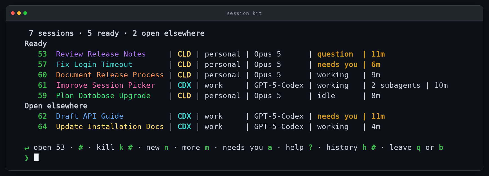
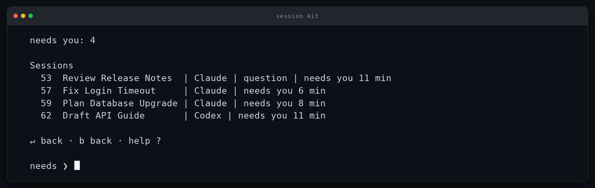
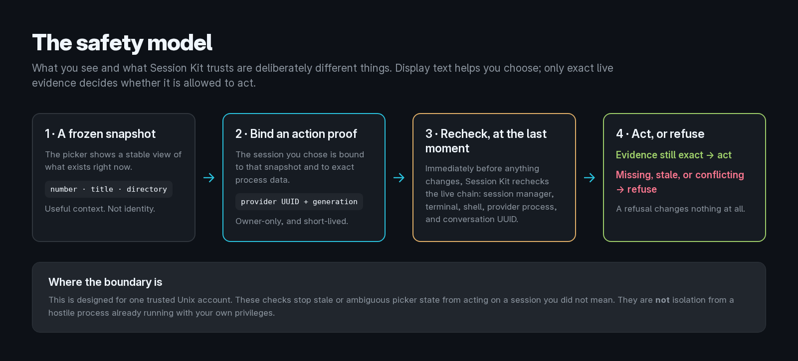
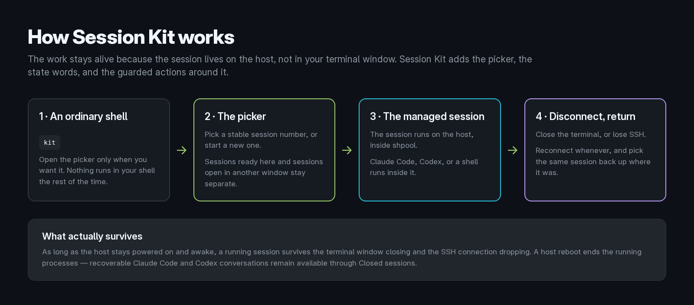

#  Session Kit

[](https://github.com/dob323/session-kit/actions/workflows/ci.yml)
[](https://github.com/dob323/session-kit/releases)
[](LICENSE)

**Many AI coding sessions. One place to see which one needs you.**

Session Kit is a terminal home screen for Claude Code and Codex. Type `kit` and every session you are running is on one screen, each with a stable number, a name, and a word that says whether it is waiting on you or still working. Type its number to go straight back in.

The sessions run on the host, so closing the terminal or dropping SSH does not end them.

<p align="center">
  
</p>

<p align="center">
  <code>kit</code> → see what needs you → type its number → back in the session.
</p>

<p align="center">
  <a href="#install">Install</a> ·
  <a href="#the-picker">The picker</a> ·
  <a href="#safety-model">Safety model</a> ·
  <a href="#accounts-and-subscriptions">Accounts</a> ·
  <a href="#delegated-work">Delegated work</a> ·
  <a href="#how-it-works">How it works</a> ·
  <a href="#documentation">Documentation</a>
</p>

> **Public beta, `v0.4.3`.** Linux with systemd, or macOS 14 and newer. I use Session Kit daily, and the beta moves quickly, so expect to update. Full detail in [Beta and support](#beta-and-support).

## Why I built it

I run several Claude Code and Codex sessions at the same time. Keeping them alive turned out to be the easy part. Remembering which one was doing what, which one had finished, and which one had been sitting there waiting on me the whole time was not. I kept opening window after window just to find the session that had asked me something.

Session Kit is the small home screen I wanted for that. I use it every day, on a local machine and over SSH to the host where the work actually runs.

It is a passion project. There is no company behind it, no paid tier, and nothing to buy. It is MIT licensed, it collects nothing, and it talks to no server of mine. I published it because it fixed a problem I hit every single day, and if you hit the same one, it will probably fix yours.

## What it does

- **See every session in one list.** Claude Code and Codex together, on one screen.
- **Know what needs you.** `question`, `needs you`, `working`, and `idle` make the next session to check obvious.
- **Jump back in by number.** Every session keeps a stable number that does not move.
- **Survive terminal and SSH disconnects.** The session keeps running on the host.
- **Know which window is which.** Sessions name and colour themselves, and the name, number, and colour follow the session into its own window.
- **Use a different account per session.** The subscription belongs to the session, not to the terminal that launched it.
- **Get a closed conversation back.** Closing a session records the exact conversation for restore.
- **Keep delegated work apart.** A machine-origin session gets its own git worktree on its own branch, and hands it back when it closes.
- **Stay local.** No hosted account, no analytics, no telemetry, no update beacon.

## Is this for you?

If you regularly have enough sessions open that you lose track of which one needs you, this was built for exactly that, and you will feel it on the first run.

If you usually keep one or two sessions going, you probably do not need it yet.

It works the same on a local workstation or on a remote host over SSH.

## Simple on purpose

The interface is deliberately small: open `kit`, see what needs you, press a number.

More is going on underneath. Before Session Kit changes a live session, it re-proves that the session is still the exact provider conversation and the exact process it expects. If it cannot prove that, it refuses instead of guessing.

The picker is a view of your sessions. It is never trusted as evidence of which live session an action should affect. That distinction is the whole design, and [Safety model](#safety-model) has it in full.

## Install

Session Kit installs per user, on the Linux or macOS machine where the work runs.

### Installing with an AI assistant

The shortest path, if Claude Code, Codex, or another terminal agent is already open: give it this.

> Install Session Kit from `https://github.com/dob323/session-kit`. Use the latest release artifact, not a clone of `main`. Download the release archive with its `.sha256` and `.provenance.json` files, verify the checksum, extract it, and run `./install.sh --check` first. Fix only the remedies that preflight explicitly names. Then run `./install.sh`, `session-kit doctor`, `session-kit services enable`, and `session-kit doctor` again. Never bypass a refused step. Show me the final doctor output and finish by telling me to type `kit`.

### Installing it yourself

Artifacts are named by the exact commit they were built from, so there is no fixed download URL. This asks the release API which files belong to the current release, checks what arrived, and only then unpacks it. It needs nothing but Python 3 and `tar`, both of which the install needs anyway.

```bash
mkdir session-kit-download
cd session-kit-download

python3 - <<'PY'
import json, urllib.request
url = "https://api.github.com/repos/dob323/session-kit/releases/latest"
with urllib.request.urlopen(url) as response:
    release = json.load(response)
for asset in release["assets"]:
    urllib.request.urlretrieve(asset["browser_download_url"], asset["name"])
    print("downloaded", asset["name"])
PY

if command -v sha256sum >/dev/null; then
  sha256sum --check session-kit-*.sha256
else
  shasum -a 256 --check session-kit-*.sha256
fi

tar -xzf session-kit-*.tar.gz
cd session-kit-*/

./install.sh --check
./install.sh

session-kit doctor
session-kit services enable
session-kit doctor
```

`./install.sh --check` is read-only. Do not work around a refusal. Session Kit prints the reason and the remedy it expects.

### Requirements

- shpool `0.11.0`, the stock build. The optional patches in [`shpool-patch/`](shpool-patch/) are **not** needed to install or to start using this; that decision can wait until something makes you want them
- Claude Code, Codex, or both
- one trusted Unix account, with per-user service access

**Linux** additionally needs a readable `/proc`, a systemd user manager, Bash 4+, and Python 3.10+.
**macOS** additionally needs macOS 14+, an active desktop login for the per-user launchd GUI domain, Homebrew Bash 4+, and Python 3.11+.

Prefer the GitHub CLI, installing without a network path to the API, or checking the provenance file by hand? [Install Session Kit](docs/install.md) has every route, plus supported shpool paths, provider setup, project import, and activation.

## First run

```bash
kit
```

New session defaults to Claude Code. A session can also be started directly:

```bash
sp new claude
sp new codex
```

Project aliases, provider choice, account selection, and configured models make those launches more specific. See [Projects](docs/projects.md) and [Use Session Kit](docs/usage.md).

## The picker

Ready sessions come first. Sessions already attached to another window appear under **Open elsewhere**. Within a group, attention state determines the first part of the order, followed by provider and activity.

The state words are deliberately small and literal:

| State | Meaning |
|---|---|
| `question` | Claude has a blocking prompt open now. Codex does not claim this state yet. |
| `needs you` | The provider finished its turn and is waiting for you. |
| `working` | The provider is driving the current turn. |
| `idle` | A needs-you transcript has not moved for the configured idle window. |
| `pending` | A launch that has not finished, or a value Session Kit cannot currently read. It is not a fifth state. |

One limit worth stating plainly: Claude Code reports a blocking prompt the moment it opens one, so `question` is exact. Codex does not expose that yet, so a Codex session reads `needs you` when its turn ends rather than the instant it asks you something.

Pressing `a` narrows the list to just those sessions, with how long each has
waited.

<p align="center">
  
</p>

The home screen keeps the common actions one key away:

| Input | Action |
|---|---|
| `Enter` or a session number | Open the first visible session, or the numbered session. |
| `k <numbers>` | Close one or more visible sessions. Lists and ranges work. |
| `n` | Start a new session. |
| `m` | Open More. |
| `a` | Show everything that needs you. |
| `h <number>` | Read settled history without opening the session. |
| `?` | Show picker help. |
| `b` or `q` | Leave the home screen for an ordinary shell. |

A session that is open elsewhere defaults to **Move it here** after a fresh identity check. The earlier window returns to its picker, and the provider conversation is not duplicated.

Every session also names and colours itself. It takes a short title from its own first piece of work, keeps a number that does not move, and gets a colour no other live session has. All three follow the session into its own window: the tab title carries the name and number, and the session is tinted its colour inside Claude Code and Codex themselves. So the window you are typing in tells you which session it is, and the picker and the session never disagree.

Press `?` for the full key reference: filtering, ranges, grouping, forking, renaming, and `g` to jump to the next session that needs you are all there. See [Picker navigation](docs/picker-navigation.md) for the cursor-driven picker, mouse behavior, action panels, machine sessions, and closed-session restore.

## Safety model

Session Kit deliberately separates **what you see** from **what it trusts**.

<p align="center">
  
</p>

1. **Provider UUID plus exact process generation is identity.**
2. Session number, title, directory, timestamps, and terminal output are display context.
3. Every mutation rechecks live identity immediately before it runs.
4. Missing, stale, partial, duplicated, or conflicting evidence fails closed.
5. A refusal changes nothing.

Before a proof-bound action, Session Kit can bind and recheck the session manager, terminal generation, managed shell, provider process and ancestry, exact provider conversation UUID, and frozen snapshot generation. The proof is owner-only and short-lived.

This is the part worth caring about: a picker one second out of date still cannot act on the wrong session, because the picker was never the evidence.

It protects against stale or ambiguous picker state selecting a different session than the one you intended. It does **not** isolate mutually hostile processes running with your own Unix-user privileges.

Read [Security and local data](docs/security-and-data.md) and [Architecture](docs/architecture.md) for the complete trust model.

## What it does not do

- **No diff review.** It will not show you what a session changed. That stays in git and your editor.
- **No cost or spend accounting.** It can read the provider's own quota percentages and tell you when one runs out, but it does not price or count tokens.
- **Not a multiplexer.** It runs on [shpool](https://github.com/shell-pool/shpool) and does not replace tmux, or try to.
- **Not a security boundary.** It protects you from acting on the wrong session, not from a hostile process running as you.

### Why not tmux?

tmux keeps processes alive, which is most of the way there, and it is already on your machine. What it cannot tell you is which of eleven panes is waiting on an answer. It has no notion of which conversation a pane holds, so nothing stops you acting on the pane next to the one you meant.

Session Kit knows both. Every session carries the identity of its provider conversation, and that identity is re-proved against the live system before anything is changed.

It runs on [shpool](https://github.com/shell-pool/shpool) rather than tmux, so there is one more thing to install first. That was the trade: shpool gives a clean session per shell without fighting multiplexer semantics, and that is what makes a session's identity provable at all.

## Accounts and subscriptions

One machine, several logins for the same provider, one per session. Enrol each account once and it becomes a choice at launch:

```bash
sp account enroll claude work you@example.com
sp account list claude
```

Each enrolled account keeps its own provider configuration directory, so a session started on it authenticates as that account and no other. Three Claude Code subscriptions can be running in three sessions at the same moment, and the picker shows which account each session belongs to, the `personal` and `work` column in the screenshot above.

This is the part most session tools do not do. A terminal multiplexer inherits whichever login the shell that started it happened to have, so every window shares one subscription. Here the account is a property of the session.

Provider authentication stays in provider-owned storage throughout. Each session launches the provider's own binary against its own configuration directory. Session Kit does not ask for, copy, print, or log provider tokens, and it does not put a subscription token into any harness of its own.

### Carrying a conversation to another account

There is a mechanism that can move one idle conversation to another enrolled account when its weekly quota runs out. **It is off, and it stays off until you turn it on.** The watchdog runs in `report` mode by default and only says what it would do; automatic changes require setting `SESSION_KIT_WATCHDOG_MODE=repair` deliberately.

Leave it off unless you have a reason. Owning several subscriptions and using each for your own work is ordinary use. Moving work between accounts *because a limit was reached* is a different shape, and it is the shape providers look for when they enforce against limit evasion, and the consequence lands on your account, not on this tool. `sp account-auto-switch <session>` shows you what would happen without doing it.

Read [Configure Session Kit](docs/configuration.md) for enrolment, verification, and the carry-over rules in full.

## Delegated work

A session started as machine-origin is given its own git worktree, on a branch the kit cuts for it, so two workers on one repository never edit the same files. Any session can ask for one by branch:

```bash
sp new claude --worktree <branch>
```

Closing the session gives the copy back, and every close does it: `sp close`, the picker's `k`, `bye` or a clean provider exit, and the scheduled cleanup pass. The copy is kept instead, with the reason named out loud, whenever giving it back could lose work: uncommitted, staged or untracked files, ignored files that were created there, a commit not yet in the reference, somebody still working in the directory, or a check that could not run at all.

A directory that is not a git repository has nothing to isolate, and a person's own session is never moved out of the directory they chose. See [Use Session Kit](docs/usage.md) for the complete rules.

## How it works

<p align="center">
  
</p>

Install Session Kit where the work actually runs.

- On a local workstation, sessions survive closing the terminal window.
- On a remote host, they also survive the SSH client disconnecting.
- The laptop you connect from can sleep, disconnect, or shut down.
- The host must stay powered on and awake for the processes to keep running.
- A host reboot ends them. Recoverable Claude Code and Codex conversations remain available through **Closed sessions**.

There is no Session Kit server to deploy.

## Claude Code and Codex

Session Kit does not replace either provider.

For **Claude Code**, it can supply the installed status line, session name and color integration, exact conversation identity, account profiles, guarded resume behavior, and optional attention evidence.

For **Codex**, it leaves the Codex status bar under Codex control, and supplies per-launch terminal-title items and the session theme without editing `~/.codex/config.toml`.

Read [Claude Code and Codex integration](docs/provider-integration.md) for the exact contracts.

## Local data and privacy

No hosted service, no Session Kit account, no analytics, no update beacon, no telemetry.

By default:

- terminal journals are off;
- external notifications are off;
- provider transcripts stay in provider-owned storage;
- the picker action log stores fixed action and outcome labels, not terminal contents;
- private Session Kit state is owner-only and is never uploaded.

Optional history can contain prompts, source code, command output, credentials, and other sensitive terminal content. Read [Security and local data](docs/security-and-data.md) before enabling it.

## Running it

```bash
session-kit doctor      # what is installed, what is wrong, and what to do
sp help                 # every command, with exit codes and selectors
```

`doctor` is the first thing to run when anything looks wrong. Updates install an immutable local release and move `current` atomically; rollback selects a verified release already on the machine. Read [Update and roll back](docs/update-and-rollback.md) before changing releases, [Configure Session Kit](docs/configuration.md) for colour, terminal titles and every setting, and [Troubleshooting](docs/troubleshooting.md) when `doctor` names something you have not met.

Session Kit runs on [shpool](https://github.com/shell-pool/shpool) and neither vendors nor replaces it. The repository carries optional shpool patches with their scope and checks; `doctor` records the shpool binary validated at installation and reports when it later changes. Read [`shpool-patch/`](shpool-patch/) before choosing a patched binary.

## Beta and support

**Settled:** the picker, session identity and the guards around every action, install, update and rollback, and the Claude Code and Codex integrations. Around 2,700 tests run in CI, with native Linux and macOS coverage.

**Not settled:** the beta moves quickly, thirteen releases in its first three weeks, so expect to update. Codex does not report a blocking prompt yet.

**What is promised:** this is a tool its author uses daily and publishes; it is not a supported product. Replies are best-effort, security fixes go into the current release with no dated windows and no back-ports, and nothing here is a security boundary against another process already running as your Unix user. Start on a single trusted Unix account where provider conversations can be recovered.

## Documentation

**[Documentation index](docs/)**, every document grouped by what you are trying to do.

The ones people reach for first:

| Topic | Document |
|---|---|
| Install | [docs/install.md](docs/install.md) |
| Use Session Kit | [docs/usage.md](docs/usage.md) |
| Configure | [docs/configuration.md](docs/configuration.md) |
| Picker navigation | [docs/picker-navigation.md](docs/picker-navigation.md) |
| Troubleshooting | [docs/troubleshooting.md](docs/troubleshooting.md) |
| Security and local data | [docs/security-and-data.md](docs/security-and-data.md) |
| Architecture | [docs/architecture.md](docs/architecture.md) |
| Release history | [CHANGELOG.md](CHANGELOG.md) |

## Contributing and support

Bug reports, documentation fixes, and pull requests are welcome. Changes that weaken the identity or safety model may be declined.

Read [CONTRIBUTING.md](CONTRIBUTING.md) before opening a pull request. Report vulnerabilities through [SECURITY.md](SECURITY.md), not a public issue. Participation is covered by the [Code of Conduct](CODE_OF_CONDUCT.md).

## License

Session Kit is released under the [MIT License](LICENSE).

The optional shpool patches modify Apache-2.0 software. See [THIRD_PARTY_NOTICES](THIRD_PARTY_NOTICES) and the included license material for those components.
