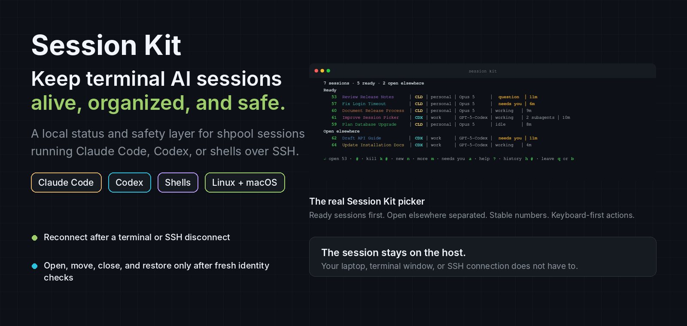
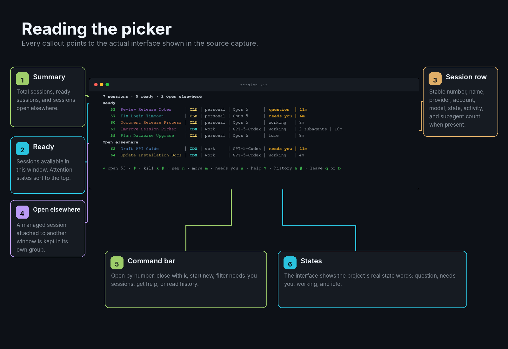
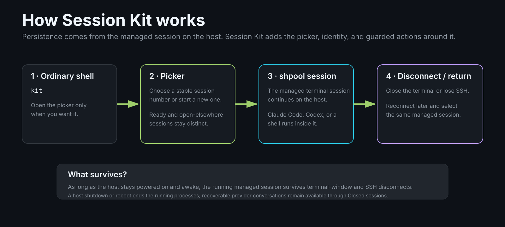
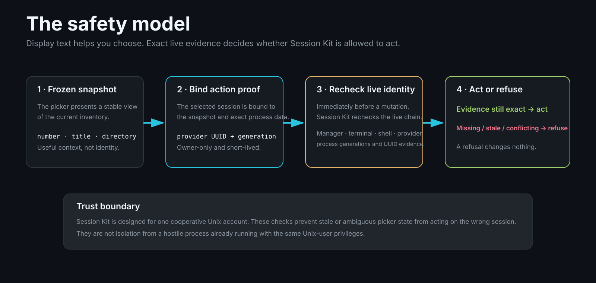

# Session Kit

[](https://github.com/dob323/session-kit/actions/workflows/ci.yml)
[](https://github.com/dob323/session-kit/releases)
[](LICENSE)

**Persistent terminal sessions and exact local safety controls for Claude Code, Codex, and shells on Linux and macOS.**

<p align="center">
  
</p>

<p align="center">
  <a href="#install">Install</a> ·
  <a href="#the-picker">The picker</a> ·
  <a href="#how-it-works">How it works</a> ·
  <a href="#safety-model">Safety model</a> ·
  <a href="#documentation">Documentation</a>
</p>

Session Kit keeps terminal AI work in one place. It gives every managed session a stable number and name, shows what needs you, separates sessions that are open in another window, and lets you reconnect after a terminal or SSH disconnect without treating display text as identity.

It runs locally around [shpool](https://github.com/shell-pool/shpool) sessions. Claude Code, Codex, or a shell stays inside the managed session on the host. Session Kit adds the picker, status model, recovery records, and proof-bound actions around it.

> **Public beta:** Session Kit `v0.4.1` supports Linux with systemd and macOS 14 or newer. Start on a single trusted Unix account where provider conversations can be recovered. Session Kit is not a security boundary against another process already running as the same Unix user.

## What you get

| | |
|---|---|
| **One picker** | Managed Claude Code, Codex, and shell sessions in one keyboard-first list. |
| **Stable session numbers** | Open, inspect, close, and find sessions without copying internal shpool IDs. |
| **Attention at a glance** | `question`, `needs you`, `working`, and `idle` have specific meanings and sort consistently. |
| **Reconnect after disconnects** | The managed session stays on the host when a terminal window closes or SSH drops. |
| **Safe move and close actions** | Mutations recheck exact live identity immediately before they run. |
| **Recoverable provider conversations** | Closing a Claude Code or Codex session records the exact conversation for restore. |
| **Local operation** | No Session Kit hosted account, analytics, update beacon, or telemetry. |
| **Provider-aware display** | Session names, account aliases, models, terminal titles, and per-session colors stay visible without becoming identity evidence. |

## The picker

Type `kit` from an ordinary shell.

<p align="center">
  
</p>

Ready sessions come first. Sessions already attached to another window appear under **Open elsewhere**. Within a group, attention state determines the first part of the order, followed by provider and activity.

The state words are intentionally small and literal:

| State | Meaning |
|---|---|
| `question` | Claude has a blocking prompt open now. Codex does not claim this state yet. |
| `needs you` | The provider finished its turn and is waiting for you. |
| `working` | The provider is driving the current turn. |
| `idle` | A needs-you transcript has not moved for the configured idle window. |
| `pending` | A placeholder for a value Session Kit cannot currently read. It is not a fifth state. |

The key-driven home screen keeps the common actions visible:

| Input | Action |
|---|---|
| `Enter` or a session number | Open the first visible session or the numbered session. |
| `k <numbers>` | Close one or more visible sessions. Lists and ranges work. |
| `n` | Start a new session. |
| `m` | Open More. |
| `a` | Show everything that needs you. |
| `h <number>` | Read settled history without opening the session. |
| `?` | Show picker help. |
| `b` or `q` | Leave the home screen for an ordinary shell. |

A session that is open elsewhere defaults to **Move it here** after a fresh identity check. The earlier window returns to its picker. The provider conversation is not duplicated.

See [Picker navigation](docs/picker-navigation.md) for filtering, marks, ranges, the cursor-driven picker, mouse behavior, action panels, machine sessions, and closed-session restore.

## How it works

<p align="center">
  
</p>

Install Session Kit on the Linux or macOS machine where the work actually runs.

- On a local workstation, managed sessions survive closing the terminal window.
- On a remote host, they also survive the SSH client disconnecting.
- The laptop or terminal you connect from can sleep, disconnect, or shut down without ending the managed session.
- The host itself must remain powered on and awake for the running processes to continue.
- A host reboot or shutdown ends the running processes. Recoverable Claude Code and Codex conversations remain available through **Closed sessions**.

There is no separate Session Kit server to deploy.

## Safety model

Session Kit deliberately separates **what you see** from **what it trusts**.

<p align="center">
  
</p>

The core rules are:

1. **Provider UUID plus exact process generation is identity.**
2. Session number, title, directory, timestamps, and terminal output are display context.
3. Every mutation rechecks live identity immediately before it runs.
4. Missing, stale, partial, duplicated, or conflicting evidence fails closed.
5. A refusal changes nothing.

Before a proof-bound action, Session Kit can bind and recheck the session manager, terminal generation, managed shell, provider process and ancestry, exact provider conversation UUID, and frozen snapshot generation. The proof is owner-only and short-lived.

This protects against stale or ambiguous picker state selecting a different managed session than the one you intended. It does **not** isolate mutually hostile processes running with your own Unix-user privileges.

Read [Security and local data](docs/security-and-data.md) and [Architecture](docs/architecture.md) for the complete trust model.

## Install

The current beta is `v0.4.1`. Beta releases are GitHub prereleases, so name the tag explicitly.

```bash
mkdir session-kit-download
cd session-kit-download

gh release download v0.4.1 --repo dob323/session-kit

if command -v sha256sum >/dev/null; then
  sha256sum --check session-kit-*.sha256
else
  shasum -a 256 --check session-kit-*.sha256
fi

tar -xzf session-kit-*.tar.gz
cd session-kit-*/

./install.sh --check
./install.sh

session-kit doctor
session-kit services enable
session-kit doctor
```

`./install.sh --check` is read-only. Do not work around a refusal. Session Kit prints the reason and the remedy it expects.

### Requirements

Session Kit requires:

- shpool `0.11.0`;
- Claude Code, Codex, or both;
- one trusted Unix account;
- per-user service access.

Linux additionally requires a readable `/proc`, a systemd user manager, Bash 4+, and Python 3.10+.

macOS additionally requires macOS 14+, an active desktop login for the per-user launchd GUI domain, Homebrew Bash 4+, and Python 3.11+.

For the supported shpool paths, platform prerequisites, provider setup, manual asset download, project import, and activation details, read [Install Session Kit](docs/install.md).

### Install with an AI assistant

If Claude Code, Codex, or another terminal agent is doing the installation, give it this:

> Install Session Kit from `https://github.com/dob323/session-kit`. Use the `v0.4.1` release artifact, not a clone of `main`. Download the release archive with its `.sha256` and `.provenance.json` files, verify the checksum, extract it, and run `./install.sh --check` first. Fix only the remedies that preflight explicitly names. Then run `./install.sh`, `session-kit doctor`, `session-kit services enable`, and `session-kit doctor` again. Never bypass a refused step. Show me the final doctor output and finish by telling me to type `kit`.

## First run

After installation:

```bash
kit
```

New session defaults to Claude Code. A new managed session can also be started directly:

```bash
sp new claude
sp new codex
sp new shell
```

Project aliases, provider choice, account selection, and configured models can make those launches more specific. See [Projects](docs/projects.md) and [Use Session Kit](docs/usage.md).

## Claude Code and Codex

Session Kit does not replace either provider.

For Claude Code, it can supply the installed status line, session name and color integration, exact conversation identity, account profiles, guarded resume behavior, and optional attention evidence.

For Codex, it leaves the Codex status bar under Codex control. Session Kit supplies per-launch terminal-title items and the session theme without editing `~/.codex/config.toml`.

Provider authentication remains in provider-owned storage. Session Kit does not ask for, copy, print, or log provider tokens.

Read [Claude Code and Codex integration](docs/provider-integration.md) for the exact contracts.

## Display

Session Kit is developed and tested against Ghostty, but any truecolor terminal can run the key-driven picker. The cursor-driven picker has a reduced-color fallback.

Use:

```bash
NO_COLOR=1 kit
```

or set `SESSION_KIT_NO_COLOR=1` when you want plain text. State words and safety meaning do not depend on color.

Opening, moving, or creating a session can push the session name into the terminal title. Returning to the picker restores `session kit`. Set `SESSION_KIT_TAB_TITLE=off` to disable Session Kit title pushes.

## Local data and privacy

Session Kit has no hosted service, Session Kit cloud account, analytics, update beacon, or telemetry.

By default:

- terminal journals are off;
- external notifications are off;
- provider transcripts stay in provider-owned storage;
- the picker action log stores fixed action and outcome labels rather than terminal contents;
- private Session Kit state is owner-only and is not uploaded by Session Kit.

Optional history can contain prompts, source code, command output, credentials, and other sensitive terminal content. Review [Security and local data](docs/security-and-data.md) before enabling it.

## Maintenance

```bash
session-kit doctor
session-kit update --source <release-directory>
session-kit rollback [--to <release-id>]

session-kit services enable
session-kit services disable
session-kit services status

sp help
sp help exit-codes
sp help selectors
```

Updates install an immutable local release and atomically move `current`. Rollback selects a verified release already present on the machine.

Read [Update and roll back](docs/update-and-rollback.md) before changing releases.

## shpool

Session Kit runs on [shpool](https://github.com/shell-pool/shpool). It does not vendor or replace shpool.

The repository includes optional shpool patches with their scope and checks. `session-kit doctor` records the shpool binary validated at installation and reports when that binary later changes.

See the repository's `shpool-patch/` documentation before choosing a patched binary.

## Documentation

| Topic | Document |
|---|---|
| Install | [docs/install.md](docs/install.md) |
| Configure | [docs/configuration.md](docs/configuration.md) |
| Use Session Kit | [docs/usage.md](docs/usage.md) |
| Picker navigation | [docs/picker-navigation.md](docs/picker-navigation.md) |
| Projects | [docs/projects.md](docs/projects.md) |
| Claude Code and Codex integration | [docs/provider-integration.md](docs/provider-integration.md) |
| Security and local data | [docs/security-and-data.md](docs/security-and-data.md) |
| Troubleshooting | [docs/troubleshooting.md](docs/troubleshooting.md) |
| Update and rollback | [docs/update-and-rollback.md](docs/update-and-rollback.md) |
| Uninstall | [docs/uninstall.md](docs/uninstall.md) |
| Architecture | [docs/architecture.md](docs/architecture.md) |

## Contributing and support

Bug reports, documentation fixes, and pull requests are welcome. Changes that weaken the identity or safety model may be declined.

Read [CONTRIBUTING.md](CONTRIBUTING.md) before opening a pull request.

Report vulnerabilities through [SECURITY.md](SECURITY.md), not through a public issue.

## License

Session Kit is released under the [MIT License](LICENSE).

The optional shpool patches modify Apache-2.0 software. See [THIRD_PARTY_NOTICES](THIRD_PARTY_NOTICES) and the included license material for those components.
